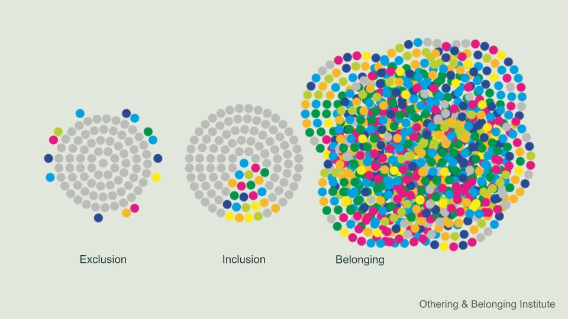

This session will explore the benefits of inclusive facilitation and develop participants' comfort and skill in facilitating virtual and in person sessions that engage people across differences. We will identify common barriers to equitable access to participation and introduce specific design for accessibility principles, tools, and techniques to overcome those barriers. We will demonstrate ways to build connection and trust among participants.

:::{.callout-tip icon="false" collapse="false"}
## Core Competencies Strengthened

_Icon legend: [Values = ]{.cc-value} | [Skills = ]{.cc-skill} | [Stewardship = ]{.cc-steward} | [Results = ]{.cc-result}_

- [ Embrace vulnerability]{.cc-value}
- [ Empathize]{.cc-value}
- [ Build capacity in others]{.cc-steward}
- [ Embrace complexity]{.cc-steward}
- [ Move at the speed of trust]{.cc-steward}
- [ Work to transform power]{.cc-steward}
- [ Ensure belonging, access and opportunity]{.cc-result}
- [ Deliver high quality results]{.cc-result}
- [ Drive cycles of continuous improvement and evolution]{.cc-result}

:::

:::{.callout-tip icon="false" collapse="false"}
##  Learning Objectives

After completing this module you will be able to: 

- <u>Design effective</u>, inclusive gatherings to tap the inherent potential of diverse groups collaborating across differences
- <u>Apply</u> methods to ensure equitable access to participation and foster trust and belonging in virtual and in person facilitated sessions

:::

 
<figcaption> **Image by Wenjia Tang, Othering & Belonging Institute**</figcaption>

:::{.callout-note icon="false"}
#### Activity: Visual Thinking Warm-up

**Part 1** - Reflect & Share

- What's going on in this picture?
- What more can we find?

:::

## Tool Highlight - Third Things

A [third thing](https://couragerenewal.org/library/chapter-7-common-ground-third-things%EF%BF%BC%EF%BF%BC/) provides a way into a topic of discussion that might otherwise feel challenging for participants. It may be a **poem, a piece of art or music, an object, a case study or a story.** It's something other than the facilitator or the participants themselves that they can focus on. Interacting with the third thing – getting into dialogue with it – can help open people up, allow them to talk about things that might not otherwise feel safe, and start to build common ground.

Working with a third thing, we use open, generative questions to invite participants in. An **open, generative question** is one that you as the facilitator couldn't possibly know the answer to ahead of time. It draws out participants' unique perspectives. It invites reflection.

We **stay in inquiry**, perhaps longer than it feels comfortable, in order to make space for everyone who wants to share to do so, to weave together more perspectives. The facilitator uses **active listening** to reflect people's ideas back in their own words and deepen everyone's understanding.

> _No one leader can know as much as a group of people who can listen to each other._ - Dabney Hailey

## Access, Inclusion and Belonging

The Othering & Belonging Institute’s definition of belonging is a beautiful place to start. Belonging is having the right to fully participate in and co-create the world you live in. Belonging means your story is fully seen and valued. Belonging means having the right to make demands on systems and structures. Belonging is being respected as an equal human being with full dignity.

According to the Othering & Belonging Institute, "Belonging is both a feeling and a practice—something we experience personally and something we create collectively." Access and inclusion are steps along the way. We can illustrate this with a gardening metaphor. 

Access means preparing the soil, watering, and providing the necessary sunlight and nutrients for different plant species to thrive.
Inclusion means designing the garden so that every plant has room to grow and thrive, without any one species choking out the rest.
Belonging is celebrating the diversity of the garden as a whole; all the plants "fit" naturally because the ecosystem is built to support variety.

 
<figcaption> **Spectrum from exclusion to inclusion to belonging**</figcaption>

## Why It Matters

> _Why should we think about access, inclusion, and belonging in our process design and facilitation?_

LegacyWorks Group's mission is to bring transformative impact initiatives to life. The core of that work is bringing people together. We envision everyone working together so ecosystems, economies, and communities thrive. Achieving that vision requires us to build more inclusive, collaborative, and connective spaces – bridging divides so that we can work together across our differences. 

Taking this seriously can have many benefits. By facilitating inclusive processes and being deliberate about building capacity along the way, this work **advances equity and helps to elevate community voices.** Engaging the experiences, knowledge, and creativity of a broader range of people and organizations who may have a perspective on the challenges we seek to address tends to lead to **better, more durable outcomes.** Finally, we know that **trust is a rate limiter in collaboration.** We can move no faster than the speed with which we build trust amongst the participants. Taking steps to enhance access, inclusion, and belonging helps build trust in the process, you as the facilitator, and amongst participants. 

In any process there are many **different types of differences** you may be trying to collaborate across. These include differences among individuals like age, race, ethnicity, gender, sexuality, education level or training, seniority, and authority. You may also be working with differences among organizations participating in the collaborative. For example, they may vary in sector, size, and whether they are public or private. Differences in organizational culture can have a big influence on the dynamics within a collaborative.
What kind of differences are you working to collaborate across in your groups?

::::{.callout-note icon="false"}
#### Activity: Lowering Barriers to Access and Inclusion

**Part 1** - Case Studies

In small groups,

- Introduce yourselves
- Assign a timekeeper, notetaker, and reporter
- Read your assigned case study
- Identify barriers to access and inclusion that might have prevented people from participating in the process described in the case study
- Identify barriers to access and inclusion that might limit people's full participation
- Think about both the visible and invisible barriers people might face. 
- Resist the temptation to get into design now. You'll have time for that later.

:::{.panel-tabset}
#### 1 - Int'l Team
This group has come together to try to identify best practices and develop a set of standards for how conservation projects around the world should engage local communities. The group makeup so far includes natural and social scientists from most of the world’s biggest environmental NGOs. The group plans to meet monthly on Zoom for two years to work on this project together. They may never meet in person. Their first meeting is in three months.

The working group leader is a white male in his late 60s, based in London. He’s in a position of power at one of the big NGOs. He spent a lot of time in the field in his early career, but seldom engages in field projects now. 

Group members come from seven different time zones across North America, Europe, Australia, Indonesia, Africa and South America. All of the current participants are fluent in English, but for many it is not their first language. When asked about anything that might limit their participation, one of the African participants shared that they will be restricted to joining via cell phone and may have bandwidth limitations. Participants vary in how much support they have from their organizations to engage in this process. 

Some of the members of the group know the project lead and each other well and have collaborated closely over the years. Others are new to the group and not well-known to the working group lead. 

There’s a desire to walk the talk of community engagement, but as of yet no mechanism to engage community input has been identified. Several smaller NGOs have expressed interest in participating but have not been formally engaged. Field staff and partners from some of the organizations have expressed concern about the potential for this set of standards to be developed without a lot of engagement from folks on the ground. 

#### 2 - Community
You and your partners are designing a community engagement process to gather public input and build community support for a proposed habitat restoration and flood risk mitigation project in an urban creek-wetland complex.

The project site encompasses a local city park that is highly valued for multiple uses including recreation, sports, family gatherings, green space, and wildlife habitat. The park includes an accessible playground with sensory interactive play panels, wheelchair-accessible swings, and other universal design features that is prized by the local disability rights community. The project site is adjacent to a densely populated neighborhood. The park and surrounding area was also a traditionally important area for local tribal members for hunting, fishing, harvest of willow for basket making, and ceremony.Properties adjacent to the creek have experienced increasing flooding and significant property damages with the rise in extreme storm events in recent years.

Project construction could impact access to the park and playground and create traffic congestion in the neighborhood for up to two years. 
You are hoping to get participation from a broad cross-section of the community, including Indigenous, Spanish speaking, youth and families, grassroots groups, homeowners, conservationists, local businesses, disability advocates, and more. Your first tasks are to recruit a planning committee, stand up a public-facing website, and start planning your first community workshop. 

#### 3 - Steering Committee
You’ve been engaged to coordinate a network of partners working together to achieve a set of shared goals related to the health of their watershed. Before you arrived on the scene, this group had elected a steering committee to serve as the decision-making body for the collaborative. There are 15 members. They represent federal, state, and local governments. There are three nonprofits represented. One of them is a well-resourced, national organization. The other two are local nonprofits. There are three at-large seats held by local community members. These community members represent agriculture, tourism and outdoor recreation, and local conservation perspectives. One of the at-large members joined only recently.

The watershed itself spans a patchwork of urban, agricultural, and natural lands. The two towns in the watershed occupy different ends of the economic spectrum. There is a significant Spanish-speaking population, many of whom are employed in agriculture or service industries. 

The steering committee meets on zoom. The one at-large member who is closely connected to the Hispanic community frequently struggles with bandwidth issues making it hard for him to attend and contribute. Participation of the local nonprofit and government reps has been spotty due to competing priorities. The newest member was very quiet in their first few meetings, though she is known for her strong contributions in other settings.

Your initial conversations with the chair reveal that the committee has been struggling to work together. Probing, you uncover a power struggle between the large NGO (represented by the chair) and one of the federal agencies in the room. The at-large committee members seem to have been largely shut out of the debate. You have separate meetings with them that reveal they have creative ideas, but feel like they aren’t being heard. They worry that community concerns are also getting sidelined. The newest member remarks that she hasn’t felt comfortable speaking up because she doesn’t know how the group works or how they arrived at this impasse.

#### 4 - Field Trip
You are planning a field trip as part of an annual two-day retreat that brings partners in your regional collaborative together. The field trip will take place on the second morning at a university research preserve managed by one of your partners. This partner is excited to show off the work they’ve been doing to study the results of prescribed fire on native plant species.

You want the field trip to be a chance for people to learn, connect, and get inspired. You also need it to be a chance for people to process some hard news you have to share about funding cuts on day one. Those cuts will have differential effects on partners - some were depending on that funding to be able to continue their engagement. This group includes a mix of personalities, including some real talkers, and you want to make sure that those who need more time to reflect and process quietly get that time before you engage everyone in a problem solving conversation.

Though folks seem excited to see the preserve, you have some concerns about accessibility. Parts of the preserve are pretty rugged. One of your participants just had knee surgery and will be on crutches. Another has a hearing impairment - the site can be very windy - will they be able to hear?  You have access to vans and an indoor conference room in the field station. You can choose among several different sites to see the prescribed fire results; they vary in their accessibility and features.

:::

**Part 2** - Share Out & Discussion

- What barriers did your group identify?
- What new insights emerged?

**Part 3** - Return to Case Studies

In small groups

- Consider your case study again.
- Brainstorm what the process designers and facilitators could do before, during, and after the gathering to increase access, inclusion, and belonging in their process. Consider, for example:
    - Communications
    - Representation
    - Compensation / participation incentives
    - Scheduling
    - Meeting format
    - Physical space
    - Technology
    - Content
    - Activities
    - Facilitator's affect, tone, body language
- Capture your ideas and any open questions that come up.

**Part 4** - Share Out & Discussion

- What ideas did your group identify to enhance access, inclusion, and belonging?
- What new insights emerged?

::::

## Inclusive Meeting Design

> _Facilitating access, inclusion, and belonging begins long before the meeting._

**It starts with recognizing the power of convening.** From the moment you decide to convene a group, you and whoever is planning with you are wielding power. Power to decide what success looks like, who to invite, and what's on the agenda. Your earliest visioning and design conversations can be a chance to build collaborative "power with" rather than "power over" the people who may participate in or be affected by your project.

One-on-one meetings, surveys, interviews, and focus groups can be used to **elicit early input from interested or affected parties** and strengthen communication channels. In addition to helping you understand the landscape of opinions and concerns related to your focal area, these tools can help crowdsource ideas to shape the trajectory of your engagement. They can also help you identify potential participants and prime them to engage.

**Who's in the room, who's not, and who gets to decide** are powerful questions. Ask yourself, who needs to be in the room for your efforts to succeed? If broader participation is necessary for success, how can you craft an invitation that folks will say yes to? What will motivate them to participate?

What might get in the way of their participation and what can you do to lower those barriers? **Common barriers for community members** include cost of transportation, lack of childcare, conflict with work schedules, language, and mistrust. Community based organizations and small non-profits may also find it difficult to participate due to resource constraints and limited staffing. 

**Virtual meetings** present their own suite of access and inclusion challenges. These can be particularly acute for international collaborations, where differences in time zone, access to technology and bandwidth, language, and culture can lead to uneven access and participation. When possible, avoid **hybrid meetings,** which lead to structural inequities in access to participation. If hybrid is the only option, invest time and attention into making sure remote participants have as full an experience as possible. 

It's best practice to **ask participants in advance what may limit their ability to participate** fully and how you can support their participation. But be aware that some people may be reluctant to call out these barriers or ask for support. They may also only share certain barriers, while other less visible or more charged challenges like power dynamics, past trauma, or imposter syndrome lurk below the surface. As process designers and facilitators, we need to **be alert for anything that stifles participation, whether spoken or unspoken.** 

See the table below and [this document](https://github.com/UKHomeOffice/posters/blob/master/accessibility/dos-donts/posters_en-UK/accessibility-posters-set.pdf) on universal design for accessibility for how to lower a wide variety of access and inclusion barriers. 

| Barriers to Access and Inclusion | Details | Ways to Address Barriers |
|:--:|:--------|:--------|
| Participation & Representation | - Women, racialized people, Global South participants, non-dominant language speakers, neurodivergent people, D/deaf and D/disabled people face extra barriers and are underrepresented   - Leadership and decision-making roles rarely reflect diverse voices   - Lived experiences are tokenized or under-valued | - Consider who’s not in the room? Who needs to be?   - Recruit participants from interested and affected groups   - Address specific barriers   - Rotate leadership roles   - Take lived experience, informal knowledge, Indigenous knowledge and other ways of knowing seriously |
| Recruitment, Onboarding & Retention Barriers | - Invitations to participate don't go beyond known networks or reach intended audiences   - Poor onboarding makes it hard for new members to know how to engage   - Lack of compensation or recognition leads to burnout / drop out | - Cultivate relationships with key communicators who can help you reach groups beyond your usual networks   - Invest time in onboarding   - Compensate people for time, travel, and other expenses   - Provide public and private recognition for people’s contributions |
| Outreach & Public Engagement Barriers | - Poorly advertised and difficult to navigate public input processes   - Meetings scheduled during work hours   - Costly to participate (time, transportation, childcare)   - Inconvenient location | - Advertise via the channels by which community members get their information and in multiple languages   - Multi-lingual surveys and other user-friendly feedback mechanisms   - Evening or weekend meetings   - Compensation   - Childcare   - Multiple venues in convenient locations   - Virtual meeting(s) to complement in person |
| Language |  - English is often the only language used, without providing translation or interpretation | - Translation (of invitation, surveys, slides, materials)--can be on the slides or as a handout   - Live interpretation (ideally simultaneous with headsets)   - Conduct meeting in non-dominant language (flip the interpretation for English speakers)   - Single language breakout groups or focus groups |
| Physical Ability | - Users of wheelchairs, walkers, canes, crutches or other assistive devices   - Limited ability to navigate stairs, walk longer distances, sit on the floor, etc. | - Accessible venue and room layout    -  Responsive agenda with options for modification for people with mobility limitations  |
| Sight | - Blind person or person(s) with visual impairment   - Colorblind person(s) | - Accessible venue   - Documents shared well ahead of time   - Large fonts, clear verbal instructions   - Use a combination of colors, shapes, and texts   - Use a color-blind friendly palette; avoid red-green contrasts   -Tech tools that are compatible with screen readers and other assistive technology   - Alt text provided for images in documents and websites    - Responsive agenda - all activities designed to include people with visual limitations |
| Hearing | - D/deaf or persons with hearing impairment | - Proper acoustics, amplified sound   -Captions and written materials   - simple language (avoiding jargon and acronyms)   - ASL interpretation  - Responsive agenda--all activities designed to include people with hearing limitations |
| Neurodivergence | - Those whose neurology diverges from what society considers typical   - Includes people with Autism Spectrum Disorder (ASD), ADHD (Attention-Deficit/Hyperactivity Disorder), learning disabilities (e.g., dyslexia, dyscalculia), and other conditions such as Tourette's syndrome, dyspraxia, and mental health conditions like anxiety or PTSD | - Use plain language   - Simple colors and layouts   - Use images and diagrams to support text   - Consider providing content in multiple formats, e.g. audio, video, written    - Make important information clear   - Give participants enough time to complete tasks   - Allow for silence |
| Technology & Virtual Meetings | - Differences in tech available to join virtual meetings (computer, tablet, phone)   - Bandwidth limitations   - Varying levels of digital literacy   - Different levels of platform familiarity / allegiance (e.g., Zoom vs. Teams)   - Institutional or country-level restrictions | - Tech host / co-facilitator to provide support   - Tech tools for virtual meetings chosen based on participants' bandwidth, technology (phone, tablet, computer), institutional or national restrictions, and level of digital literacy   - All activities designed to work regardless of how a participant is joining   - Backup options if tech fails for an individual or the group   - digital literacy training (e.g. tech tool tutorials or demos)
| Hybrid Participation | - Remote participants (or those on the phone when others are on video) experience barriers to participation | - Display remote participants' video on a large screen to keep them in the group's consciousness   - Ensure remote participants can see and hear what's happening in the room   - In intros, Q&A, or discussions, start with the remote / phone participants--don't let them be an afterthought   - Structure in chances for remote participants to contribute (e.g., go-arounds)   - Pair each remote person with an in person participant charged with keeping their remote partner engaged. In person attendee joins via laptop with video only to avoid audio feedback   - Dedicated person to monitor remote participants, invite their comments and questions   - Adapt breakout activities for remote participants; provide facilitation when possible   - Provide shared digital resources--slides, notes, etc. |
| Time Zone | - Working hours across time zones may have little overlap | - Schedule during working hours for all participants if possible   - Rotate underdesirable meeting times amongst participants if not |
| Funding | - Travel, prep time, and accessibility costs often not covered   - Funding, if available, usually goes to organizations, not individuals, limiting grassroots involvement   - Complex travel and visa processes may limit international participation | - Identify funding barriers and allocate funds to enhance inclusion when possible   - Travel assistance |
| Trust & Power | - Leadership doesn't reflect marginalized communities   - History of injustice or broken trust   - Lack of transparency in project aims or decisionmaking | - Representative leadership   - Rotating leadership   - Trauma-informed practices   - Open, regular, transparent communication |
| Knowledge & Training | - New participants, especially those from marginalized groups may experience knowledge barriers   - Challenges understanding technical content   - Power imbalance between "experts" and others | - Robust onboarding   - Simple, de-jargoned language   - Normalize asking questions   - Center other ways of knowing, including lived experience, Indigenous knowledge, and practitioner knowledge   - Create opportunities for everyone to learn from each other |

## Power Dynamics
Power dynamics – the ways in which power works in a setting – can either derail a process and negatively impact relationships for years, or produce more shared power and capacity to get things done. The outcome depends on how well we plan (including what happens within and outside of meetings and how well we attend to power dynamics and facilitate in the moment.

Power — the capacity to get things done — is neither positive nor negative in and of itself. There are healthy exercises of power that focus on growing power to achieve positive outcomes by building “power with” others. Unhealthy power is focused on establishing “power over” others or concentrating power in a few.

As facilitative leaders, we strive to wield a healthy power. We develop the capacity of the group to work together through our influence and their trust in us and in the process. Our ability to name and navigate the power dynamics in a group is a key element of building the trust of all members. 

In any group, the individuals vary in their level of power. Their overall power is a combination of their status across a number of different dimensions of power that humans tend to pay attention to. Eugene Kim of Faster than 20 has articulated the following types of individual power:

- *Structural Power* - the power you have based on your title or position in the organization, or physical access
- *Cultural Power* - the standing society gives you based on your race, ethnicity, gender, sexuality, age 
- *Relationships Power* - whom you know and the nature of those relationships
- *Individual Power* - charisma, physical characteristics, etc.
- *Domain Knowledge Power* - knowledge or expertise relevant to what the group's objectives or topic of conversation

Individual power may be context dependent. I have a lot more power when I am in a setting that preferences my particular expertise than if I am in a setting I know nothing about. Individuals can also act to alter their power by making "moves" that either increase or decrease their power within a group. As facilitators, we need to pay attention to those moves in order to manage the group dynamics well.

#### Activity: Power Lens

**Part 1** - Power Ranking

- Make a copy of this [document](https://docs.google.com/presentation/d/1S1p2TLljhqrG5BZ3_JA3WVaeVSVYxmZBpSc70rmFdx8/edit?usp=drive_link).
- We're going to apply this to a movie scene but you can use it for any group setting. 
- What’s the level of trust in this group?
- In each column, write the names of the group members in order of those you think have the most power to those you think have the least based on the column category. No ties! Add notes explaining why you ranked folks where you did. Think about how the rankings in the different categories contribute to your overall ranking.
- On the second page, list the different power moves you noticed and their impacts.

**Part 1** - Discussion

- Let's compare our results
- Could you imagine applying this to a group you are part of?
- What would you do with the information afterwards? 
- What are some ways you can address power dynamics as a facilitator or group member?

:::

## Working with Power
> _What are some ways you can address power dynamics as a facilitator or group member?_

As the facilitator there are many ways you can intentionally shift the power dynamics. The following suggestions are widely applicable and effective:

- Assume power dynamics are present.
- Name them. Sometimes just having the courage to daylight a power imbalance can shift the dynamic.
- Be conscious of your own power as the facilitator. Strive to remain as objective as you can (recognizing the facilitator is never 100% neutral). If you want to contribute an idea or opinion, say "I'm going to take off my facilitator hat and voice my personal opinion."
- Make space for all voices structurally, e.g., with activities that go-arounds, silent google doc'ing, and breakouts
- Make time for authentic human connection
- Draw out and amplify less powerful voices
- Wield your attention (including your eyes, body language, and words) more equitably and the group will follow - stop deferring to the most powerful people in the room
- Mix up formats
- Rotate roles

## Belonging & Trust

Creating an inclusive culture where people feel a sense of belonging takes time and intention. It is work that is never done. But by pursuing belonging, we create spaces where every voice matters and where everyone can flourish.

Perhaps our most important role in supporting belonging as facilitative leaders is building trust. Without it, little progress will be made. Simple ways to build trust include:

- Establishing your own credibility with the group as an objective and legitimate facilitator
- Co-creating working agreements and providing accountability if they are violated
- Modeling the working agreements and shared values of the group - "walking the talk"
- Following through on commitments
- Owning your own mistakes and biases
- Designing in time for personal connections and informal communication
- Providing safe invitations for authenticity and vulnerability
- Prioritizing regular, open, transparent communication and information sharing
- Doing fun things together
- Doing difficult things together

## Additional Resources

### Papers, Blog Posts, and Books
- Khuri et al., Inclusive Practice Glossary for Facilitators. **2024.**
- brown, a.m. Holding Change: The Way of Emergent Strategy Facilitation and Mediation. AK Press. **2021.**
- Stein Greenberg, S. Creative Acts for Curious People: How to Think, Create, and Lead in Unconventional Ways. a Stanford d.school book. Ten Speed Press. **2021.**
- Tarallo, B. & Monlux, M. Surviving the Horror of Online Meetings: How to Facilitate Good Virtual Meetings & Manage Meeting Monsters. **2021.**
- john a. powell & Rachel Heydemann. [On Bridging: Evidence and Guidance from Real-World Cases.](https://belonging.berkeley.edu/on-bridging) **2020.**
- Kelly Frances Bates, Cynthia Silva Parker, Curtis Ogden. [Power Dynamics: The Hidden Element to Effective Meetings.](https://interactioninstitute.org/power-dynamics-the-hidden-element-to-effective-meetings/) Interaction Institute for Social Change. **2018.**
- [Designing for Accessibility.](https://github.com/UKHomeOffice/posters/blob/master/accessibility/dos-donts/posters_en-UK/accessibility-posters-set.pdf) UK Home Office. 

### Workshops
- [OBI University free courses](https://obiu.org/), Othering & Belonging Institute
- [Power and Love for Managers](https://fasterthan20.com/training/power-and-love-for-managers/), Faster than 20
