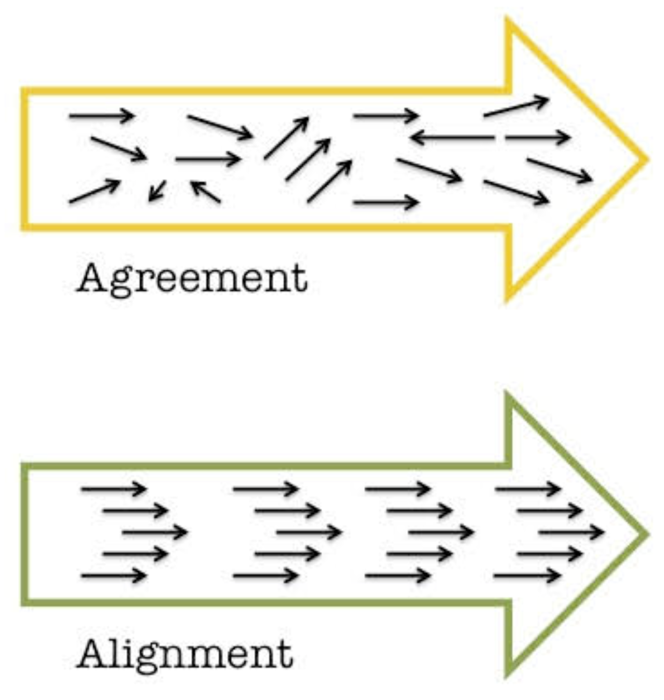
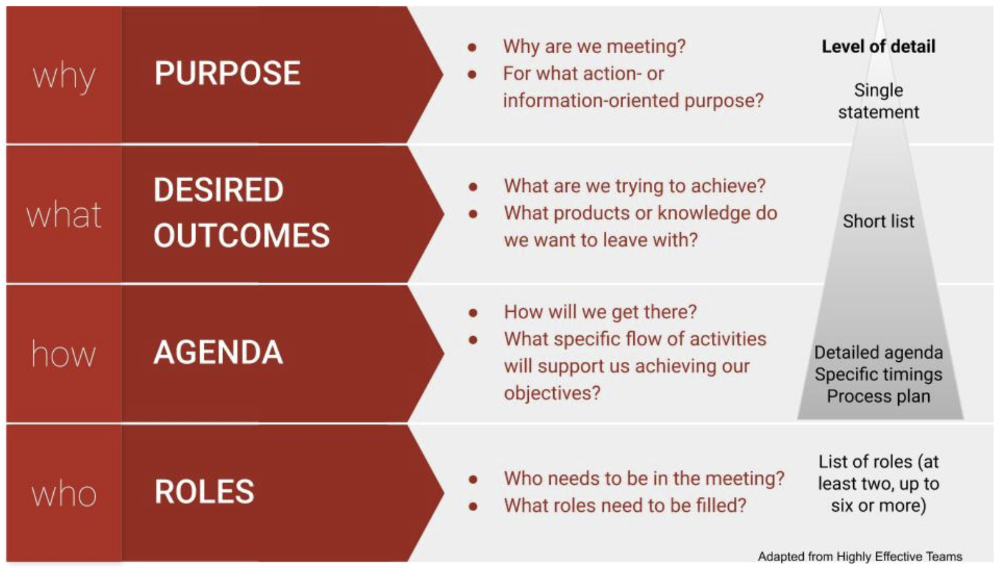
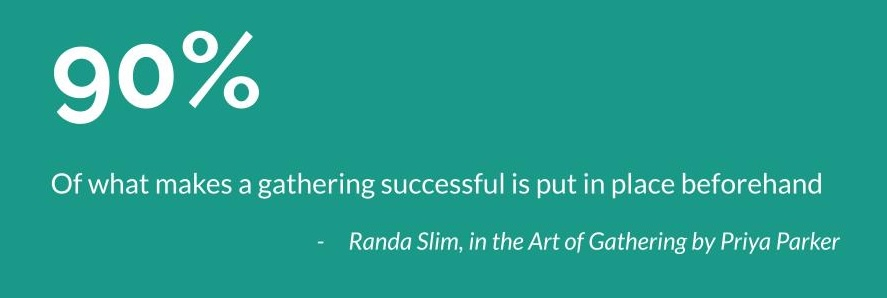
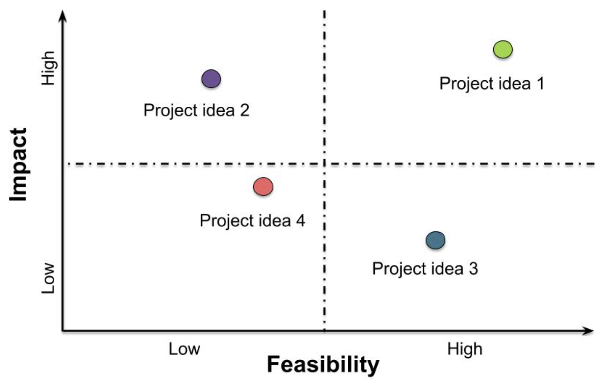
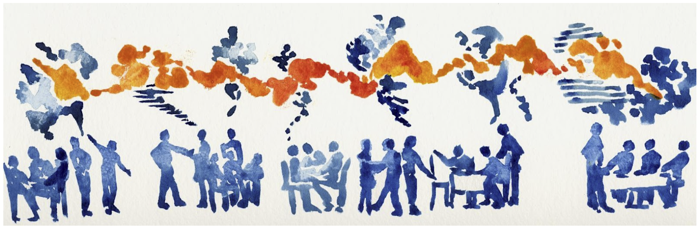
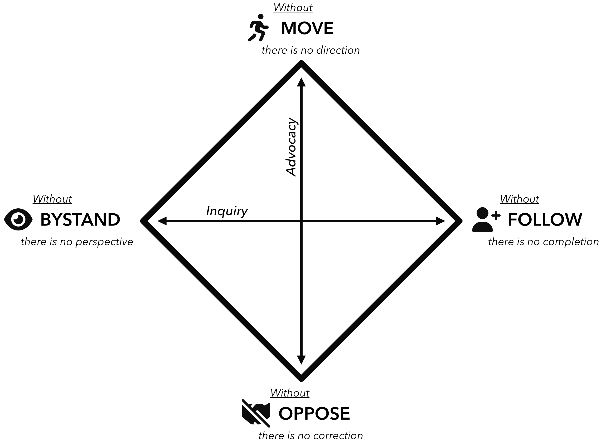
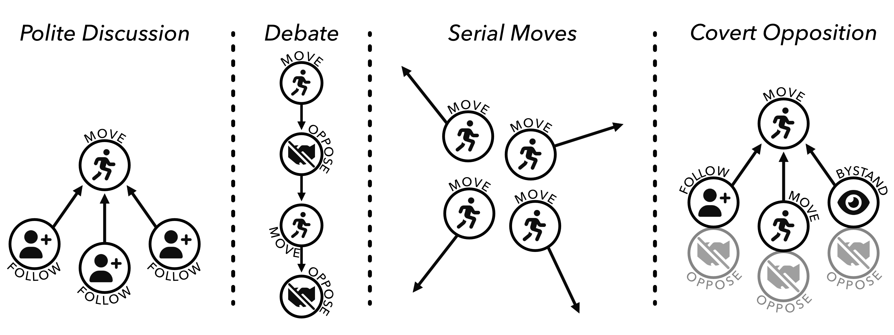

This session will offer best practices for in person and virtual meeting design. We will demonstrate a set of “[Liberating Structures](https://www.liberatingstructures.com/ls/)” for engaging, effective group meetings. And we will practice using David Kantor’s Four-Player Model as a way to “read the room” and diagnose and shift group dynamics.

:::{.callout-tip icon="false" collapse="false"}
## Core Competencies Strengthened

_Icon legend: [Values = ]{.cc-value} | [Skills = ]{.cc-skill} | [Stewardship = ]{.cc-steward} | [Results = ]{.cc-result}_

- [ Work with adaptability]{.cc-value}
- [ Active listening]{.cc-steward}
- [ Build capacity in others]{.cc-steward}
- [ Embrace complexity]{.cc-steward}
- [ Move at the speed of trust]{.cc-steward}
- [ Work to transform power]{.cc-steward}
- [ Deliver high quality results]{.cc-result}

:::

:::{.callout-tip icon="false" collapse="false"}
##  Learning Objectives

After completing this module you will be able to: 

- <u>Describe</u> benefits of facilitating full, thoughtful, engaged participation in group settings
- <u>Design</u> effective, inclusive gatherings to tap the inherent potential of diverse groups and reach shared goals
- <u>Analyze</u> group interactions and identify ways to unlock stuck dynamics and foster greater participation and collaboration

:::

::: {.callout-note icon="false"}
#### Activity: Weaving Connections

**Part 1**

On your own:

- Reflect silently on the following questions and provide input via the anonymous poll
    - What's one thing you do or your team does that enhances the  effectiveness of your meetings?
    - What's one thing that’s challenging about your meetings that you would like to improve? 

**Part 2**

In small groups:

- Spend a few minutes introducing yourselves and checking in with each other
- Share what's working, what could be improved (2 mins each)

:::

::: {.callout-warning icon="false"}
#### Discussion: Rapid Assessment

As a whole class, let's discuss your answers to the following questions:

- Where is our learning edge?
    - What are some common areas you identified where we have room to improve our meeting design and facilitation practices? 

:::

### Tool Highlight: Polls, Check-ins, and Think-Pair-Share

**Polls** are useful tools for collecting input. They can be deployed synchronously or asynchronously, anonymously or not. Consider using them before a meeting to understand the group's starting point and help shape the content. Use them during a meeting to collect real time data. Or use them after a meeting to gather feedback. Zoom's integrated polling is simple but effective. Other options include slido, mentimeter, and google forms.

**Check-ins** introduce a little humanity into your meeting and get people warmed up for interaction. Make them a regular part of your meeting culture. Simple prompt options include:

- What's something you are feeling grateful for today?
- One word or phrase for how you are showing up today
- A bright spot from your week

Or design a prompt that helps people begin to connect with the content of the meeting through reflecting on a related personal experience. Provide time for personal connection at the beginning and throughout your meeting. When designing breakout groups, build in five minutes for people to check in with each other. Many will do it anyway, and building in this time helps build group cohesion and trust.

**Think-Pair-Share** is a common teaching tool that is very effective for engaging groups in reflection and discussion. Starting with individual reflection suits those who like to process ideas in quiet. Discussing in pairs allows everyone to share their ideas and learn from each other before highlights are lifted up to the whole group. "[1-2-4-all](https://www.liberatingstructures.com/1-1-2-4-all/)" (sometimes also called "think-pair-square-share") is a related microstructure that can be used to rapidly share and sift ideas in any group of eight or more people. In a virtual setting, to simplify breakout room logistics, it's easiest to just have three levels: individual, breakout groups of 2 or more people, and whole group.

## Benefits of Enabling Full Participation

So what is an effective meeting? It's one that achieves your purpose, taps the full potential of the group, and wastes no one’s time. Reaching that bar will take some intention!

Good meetings promote: 

- Engagement - they keep people's attention and invite their participation
- Connection - the more we feel connected, the more we trust the group and the meeting as a space where we can contribute
- Creativity & inclusivity - because we never know where good ideas will come from
- Productivity - we want results and we want to use people’s time well
- Future collaborative potential - they make people want to stay engaged and to keep contributing 

Creating the conditions for all members of a group to feel welcome and able to fully participate advances diversity, equity, and inclusion. It also has functional benefits, as diverse teams have been shown to be more productive than less diverse teams. In part, that productivity can be attributed to the ability of the group to elicit and work with novel ideas and approaches, allowing more innovative analysis and problem solving.

Facilitating equitable participation also helps to unleash the full capacity of a team to get things done. Too often, potential contributors opt out of offering their skills and talents to a collaborative endeavor because they feel undervalued or unclear on how to contribute. It might not feel worth their time to try to assert an idea or opinion when it doesn't feel welcome. A process that creates opportunities for everyone to engage and feel included can help avoid this situation.

Finally, when the time comes for decision making, effective facilitation can ensure that the full range of questions, opinions, and concerns has been surfaced and weighed before the group makes a decision. This is critical. If you move forward with surface-level agreement, but without true alignment, commitment to the decision is likely to erode over time. 

## Purpose Driven Process Design

Good meeting design starts with understanding your purpose and desired outcomes, as well as your participants. Do you need to share or gather information? Have a discussion? Reach a decision? Connect? Celebrate? Kickoff or bring to a close?

In The Art of Gathering, Priya Parker encourages us to not skip over the important first step of deciding why we are gathering and committing to a bold, sharp purpose. If we skip this step, she warns, we may let old assumptions dictate the form or our gathering and miss opportunities to create more powerful experiences for ourselves and our participants. Parker reminds us that a category - like weekly staff meeting, book club, board meeting, or networking event is _not_ a purpose. 

Once you understand why you need to meet (your purpose) and what you want to accomplish (the specific outcomes you are driving toward), you can turn to how you will accomplish your purpose (i.e. the format, agenda of activities, timings, and tech) and who will play what roles. All your choices should flow from your particular purpose. 

A good rule of thumb is to allow 2-3x as much time to plan a meeting as its duration. 

::: {.callout-note icon="false"}
#### Activity: Team Planning

**Part 1**

On your own, think about an upcoming meeting that hasn't yet been planned

- _Why will you be meeting? What do you think should be the purpose of that meeting?_ 

**Part 2**

In your pair:

- Interview your partner using the [Nine Whys](https://www.liberatingstructures.com/3-nine-whys/) format. Keep digging by asking more Why questions until you both feel like you understand the fundamental purpose of the meeting. 
    - Help your partner to write a single sentence that captures the bold purpose for their meeting 
    - Help them identify 1-3 intended outcomes to capture what they specifically hope to achieve in the meeting
- Switch roles

:::

### Tool Highlight: Spectrum of Success

For longer or more complex meetings or events (or entire projects), the [Spectrum of Success](https://docs.google.com/document/d/1RvFT2jiwSEm-fw-uA0gaQ9yrN8PsYAaj6W-Q0ll7S44/edit?usp=sharing), developed by Eugene Kim at [Faster than 20](https://fasterthan20.com/) is an excellent tool for elaborating on your purpose and intended outcomes. In each of four columns, along a spectrum from failure to epic success, you articulate specific, concrete metrics of success that you can design for and track progress against. We love using this tool at the start of a co-design process. You can use it with collaborators or clients to build a shared understanding of what you are trying to achieve and how you want the process to feel along the way.

Your metrics of success or failure should include:

- Tangible outputs - what we might produce
- Short or long term outcomes - what we might achieve
- Process-based indicators - how we want to work together or show up in collaboration

| **Failure** | **Minimum / Essential Success** | **Target Success** | **Epic Success** |
|:----------|:----------|:------------|:----------------|
| _Success means avoiding 100% of these_ | _Success means achieving 100% of these_ | _Success means achieving 40-60% of these_ | _What if we were successful beyond our wildest dreams? May depend on forces beyond our control or beyond the project scope_ |
| e.g., Feels like a waste of people's time | e.g., Participants are engaged and find the meeting useful | e.g., Novel solutions emerge from the collective contributions of a deeply engaged group | e.g., Leaders step up from within the group to lead a new collaborative initiative to tackle a longstanding problem |

## Inviting and Priming

With your bold purpose in mind, you can turn next to identifying and priming your participants. Ask yourself:

- Who needs to be in the room?
- How do we need them to show up?
- Who not only fits, but also helps fulfill the gathering’s purpose?
- Who threatens the purpose?
- Who, despite being irrelevant to the purpose, do you feel obliged to invite?
- Who is this gathering for first?

Again Priya Parker has some useful advice: "Make purpose your bouncer." Use your purpose to filter your invitation list, deciding not just whom to invite, but also whom to exclude. Then, invest some time to prime your participants so that they can show up to the meeting and engage productively. 

Ways to prime your participants:

- Craft a clear, compelling invitation so they understand the meeting purpose and why they were invited
- Send out the agenda in advance (always best practice!)
- Provide pre-reading materials or pre-work (but weigh the tradeoffs - not everyone will do their homework - how necessary is it?)
- Meet with them 1:1 ahead of the meeting

## Roles

It's very difficult to both facilitate a conversation and engage fully in it as a participant. If you add taking notes on top of that, it's sure to become overwhelming. So recruit some help. The number of roles you need to fill will depend on the size of the group and the complexity of the process. Online meetings particularly benefit from a team approach to facilitation. Share and rotate duties over time:

- **Process facilitator** - sets tone and pace, mediates conflicts, and ensures all voices are being heard, interpersonal dynamics are positive/effective, and group is staying on task
- **Meeting chair** (optional) - keeps an eye on the overall vision and progress of the meeting
- **Timekeeper** - may also be the chair or facilitator
- **Tech Host** - monitors chat, sets up breakout rooms, records meeting, troubleshoots technology as needed in virtual/hybrid meetings
- **Notetaker** - captures action items and notes, often in a google doc that can be viewed and added to by others; may also produce a meeting summary
- **Scribe** - captures important points that can be seen in real time by the whole group, usually on a whiteboard or flipchart
- **Spotter** - keeps a running list of who is waiting to speak (especially in large groups or intense discussions)
- **Mediator** - tracks group dynamics, supports inclusion and engagement, provides conflict resolution support as needed, may also be the facilitator
- **Participation monitor** - engineers opportunities for participation, quells interrupters, amplifies and credits the messages of quieter participants, may also be the facilitator

As you get to know your team members, you can start to match people to these different roles based on their skills and recruit them to help.

## Ensuring Equitable Access to Participation

To tap diverse perspectives and catalyze productivity and creative problem-solving, we need to design meetings (and projects) so <u>everyone</u> can participate fully, rather than just a few. When tackling complex challenges, voices from the edge are often critical to uncovering new insights and approaches. Democratizing participation doesn't have to be all about controlling the dominant voices in a group; with thoughtful planning and some simple tools, you can design any conversation so that everyone can contribute.

A few simple techniques can help:
 
1. Mix up the format, e.g., combining silent reflection, go arounds, breakout groups, plenary, and/or "liberating structures" (more on these below)
2. Offer different channels for information sharing - verbal, nonverbal, written, visual, informal, formal
3. Track who wants to speak and call on people in order
4. Invite, amplify, and credit "quieter" voices 
5. Use active listening - reflect back what you think you are hearing in simple terms and check your assumptions regularly

Be creative and empathetic when you design your agenda. Think about your participants and what is going to help _all of them_ participate fully and creatively. Differences among your group members can affect power dynamics, participation, and information processing. Design your facilitation with these and other differences in mind and you'll get better results:

- Introverts vs. extroverts
- Visual, auditory and kinesthetic learners
- Neurodivergence
- Differences in education, training, and ways of knowing
- Organization type
- Role and career stage
- Culture, race, and ethnicity
- Age
- Gender
- Language
- Time zone (for geographically distributed teams)

## Designing Meetings for All Thinking Styles

People have different thinking preferences which influence what they expect and enjoy in group processes (see Ned Herrmann's Whole Brain Model below). A well designed meeting provides pathways for participation that satisfy each of these different preferences. 

Take this [short quiz](https://docs.google.com/document/d/1XZD_7oVnS6JoFVUfhhXb3pMgSleW_1AK4YDsMEvlwgI/copy) to understand your own thinking preferences better. 

The Microstructures Tool Highlight later in this module offers activities that work well for each of the different thinking styles.

<figcaption> Ned Herrmann's Whole Brain Model </figcaption>

## Alternatives to Conventional Meeting Structures

Differences in thinking and learning styles, culture, training, career stage, and other dimensions of diversity mean that there's no such thing as a one-size-fits-all approach for participatory processes. Nonetheless, we tend to default to a small set of traditional ways of sharing information and engaging people when we meet. These conventional structures are often either too limiting (presentations, status reports, and managed discussions) or too free-form and disorganized (open discussions and brainstorms) to effectively tap the wisdom of the group (Lipmanowicz and McCandless, 2014). To support the engagement of all participants, we need to break out of those traditional ways of meeting.

Books and websites like Liberating Structures, Gamestorming, and the Facilitator's Guide to Participatory Decision Making offer dozens of alternative group processes (see Resources). Known as microstructures or knowledge games, these simple, fun activities are designed to include everyone, distribute control, and unleash creativity. One or more activities can be matched to your intended outcomes and arranged in a sequence to advance the team toward your overall goal. Liberating Structures offers a [matching matrix](https://www.liberatingstructures.com/matching-matrix) to help you identify microstructures that could fit your needs and an app you can use to browse and assemble strings of activities. [Gamestorming](https://gamestorming.com/) organizes their activities into categories (e.g. games for opening, games for decision-making) for exploration.

Here are a few microstructures that work well for small to large, in person or virtual meetings:

### Tool Highlights: Microstructures

| **Microstructure** | **Thinking Preference** | **Purpose** | **How It Works** |
|:---|:---:|:------------|:---------------------|
| Icebreaker / check in | **Relational** | Connect as a team, start on a positive, human note | Many versions exist, e.g., one word to describe how you are arriving; one thing you are feeling grateful for today; coolest thing you've learned lately; describe where you grew up without using any place names, etc. |
| Round robin / go around | **Analytical**, **Relational** | Hear from everyone | Everyone answers the same prompt. Alternatives to going in order: each speaker calls on the next person after they have shared - keeping track of who has / hasn't spoken keeps people paying attention; popcorn-style - people share in the order that they feel moved to speak |
| [1,2,4,all](https://www.liberatingstructures.com/1-1-2-4-all/) | **Analytical**, **Practical**, **Experimental**, **Relational** | Engage everyone in generating questions, ideas, and suggestions | Individual reflection; Pair share; Two pairs combine and share as a group of 4; Small groups share highlights with whole group |
| [Min specs](https://www.liberatingstructures.com/14-min-specs/) | **Experimental** | Specify simple rules the group must follow to achieve your purpose | 1,2,4,all format; Individuals brainstorm things the group must do or must not do to achieve its purpose; Share in pairs or small groups; Pare the list down to the minimum set of rules you could follow and still achieve the purpose |
| [Affinity Map](https://gamestorming.com/?s=affinity+map) | **Analytical**, **Relational** | Surface ideas, detect patterns, and analyze | Brainstorm ideas using sticky notes on a wall or virtual whiteboard; Cluster into categories; If useful, prioritize within categories |
| [Brainwriting](https://gamestorming.com/brainwriting/) | **Analytical**, **Practical**, **Experimental**, **Relational** | Surface and elaborate ideas | (1) Brainstorm ideas in a google doc or virtual whiteboard (or on index cards in person); (2) Read and add to each other's ideas; (3) Discuss |
| [What, So What, Now What](https://www.liberatingstructures.com/9-what-so-what-now-what-w/) | **Analytical**, **Practical**, **Experimental** | Make sense of past progress or experiences and decide on future actions | What - As a group, compile the facts and observations relevant to the context; So What - Reflect on the facts and their implications, identify patterns, generate hypotheses; Now What - Draw conclusions - What actions make sense? |
| [Fist to Five](https://gamestorming.com/five-fingered-consensus/) / Gradient of Agreement | **Practical**, **Relational** | Assess degree of consensus; seek closure | Use when ready to close a discussion or make a decision; Invite participants to rate their level of agreement with a proposal on a scale of 0-5; Five fingers means "absolute, total agreement or support" and a fist means "complete opposition" |
| Polling | **Analytical**, **Practical** | Rank alternatives | Before you start - clarify how you will use the results - are you gathering information or taking a vote to make a decision?; Decide how many votes per person; In person - use sticky dots; Virtually - use +1s in a google doc or a digital polling tool (e.g., Zoom, Mural, slido) |
| Feasibility-Impact Matrix (see figure below) | **Analytical**, **Practical**, **Experimental** | Compare alternatives | Discuss and agree on definitions for two criteria for evaluating ideas: feasibility of implementation and impact potential; Rate each idea against these two axes and map onto 2x2 grid |

## Capturing Content

As you go, and definitely before your meeting is over, engage your team in synthesizing and capturing the information that has been discussed. This helps you to deepen understanding, document decisions, identify action items, and pick up easily next time. Use a consistent system - like a running notes document linked in the calendar item. Graphics or drawings can be a valuable complement to oral and written content in making thinking visible.

<figcaption> Making thinking visible, Credit: Nancy Margulies, World Cafe, Flickr </figcaption>

Consider using:

- Grids to organize information
- Conceptual models or mind maps to articulate shared understanding of complex systems 
- Purpose statements, project briefs, and other written collateral to distill ideas

When capturing notes, try to use people's own words; if necessary pause and ask them to distill long or complex points into a headline you can capture. Invite them to offer corrections if the notetaker didn't capture what they meant.

## Online Meetings

Online meetings benefit from all the same considerations as in person meetings, plus a little extra care and planning. Keeping your team engaged is doubly challenging in a virtual setting: our computers are full of distractions (email! notifications! internet rabbit holes!) AND as the facilitator, it's harder to tell whether participants are engaged when all you have to go on is a small video window. Managing people's energy and attention and creating opportunities for real human connection are real challenges. On the flip side, online meetings allow distributed teams to stay connected and can provide a dynamic and rich platform for shared work.

In addition to the general tips above, in online settings:

1. Be thoughtful and equitable when scheduling across time zones
2. Develop online meeting norms for your team and enforce them (e.g., use of chat, indicating you want to speak)
3. Ask a team member to help you monitor the chat and assist participants with tech or connectivity challenges
4. Encourage personal connection (e.g., with check ins, invitations to have video on)
4. Check engagement regularly
5. Provide breaks (bio breaks, silence, invitations to step away from the screen for reflection)
6. Make video optional 
7. Take advantage of tech tools (breakout rooms, polls, shared notes, virtual whiteboards, recording, transcription, etc.)

### Tool Highlight: Collaborative Whiteboards

**Collaborative whiteboards** are useful tools for capturing ideas from a group during virtual meetings. They range from simple (EasyRetro, Zoom's whiteboard function) to complex (Mural, miro). Benefits include simultaneous input, the ability to organize information into discrete, movable chunks, and the visual (and lasting) nature of the output.

::: {.callout-warning icon="false"}
#### Discussion: Team Planning & Wrap Up

As a group, let's discuss your answers to the following questions:

- What activities did you identify to help make your meeting inclusive to everyone who will attend?
- Where would you like advice from the group?
- Are there other questions you are holding related to inclusive facilitation?

:::

## Reading the Room

David Kantor's Four Player Model is a helpful tool for diagnosing "stuck" patterns of communication, (including entrenched debate and polite discussion), and interceding to help shift to a more productive pattern. 

Based on over 30 years of observation and study of face-to-face communication in many groups, Kantor developed the Four Player Model and a broader theory of Structural Dynamics. The model identifies four actions of effective communication:

- **Move** - Initiate an idea, action, or direction for conversation
- **Follow** - Continue the direction or flow of the conversation; support a move, either by agreeing or asking for more information
- **Oppose** - Challenge or disagree with the idea, action, or suggested direction
- **Bystand** - Notice and articulate what's happening in the conversation, add a neutral perspective

Each action in a group conversation can be coded into one of these four action modes. Most of us have one of these modes that we feel most comfortable in and tend to default to in a group. The most effective conversations involve good listening and the skillful use of all four modes. Common "stuck" patterns emerge when groups are not deploying all four actions.

:::{.panel-tabset}
#### Serial Moves

Lots of idea generation; may feel like a barrage; no clear thread, decision, or follow through

#### What to Do

Any of the other modes can help here, since move is the only mode being engaged.

Add a **follow** to give momentum to a particular move and steer the conversation in that direction, e.g., "Can we go back to the idea that Jose put on the table? That felt like a topic that could really use our attention. Shall we focus there?"

Offer an effective **oppose** - "We've heard a lot of different ideas. I'd like to focus on the one Amelia laid out. I'm interested in the problem she posed, but I don't think AI is going to be the most productive approach to solving it. Can we dig in to this one?"

Use a **bystand** to bring awareness to and disrupt the dynamic - "Hey gang, we're 20 minutes into our call and we've put a lot of different topics on the table. Where do we want to focus ourselves so we can walk away with some clear next steps?"

:::

:::{.panel-tabset}
#### Polite Discussion

Moves are followed with little discussion or resistance; also known as Courteous Compliance

#### What to Do

Prompt an effective **oppose**: 

- Who sees it differently? 
- What's at risk here? 
- What other angles should we consider?

Invite a **bystand**:

- Where is the group right now? 
- What are you noticing? 
- Is there an elephant in the room that needs to be named?

:::

:::{.panel-tabset}
#### Point-Counterpoint / Debate

Individuals are locked in a back and forth where each move is met with resistance / opposition

#### What to Do

Invite a **follow**: 

- What do you like about the proposal on the table? 
- What do you agree with that we could build upon?

Coach for a more effective **oppose** by inviting those who have been opposing to identify some aspect of the idea they do agree with (even if only 2%), in addition to the specific aspects they object to.

Invite a **bystand**:

- In addition to the two viewpoints on the table, I'd love to hear from some other perspectives. 
- What are you noticing? 
- What might we be missing?

:::

:::{.panel-tabset}
#### Covert Opposition

On the surface, moves are followed, and the conversation appears harmonious, but below the surface, people have unspoken reservations. Opposition tends to be expressed outside the bounds of the conversation or harbored as resentment.

Uneven power dynamics are often behind this pattern - group members defer to the moves of those with more power or seniority.

#### What to Do

Invite those with more power to experiment with **following** or **bystanding** to open up space for other players to make a **move**.

Prompt a transparent **oppose**: 

- Who sees it differently? 
- What's at risk here? 
- Are there some cons to the proposed idea?

If others aren't comfortable, you can offer an **oppose**, e.g., by suggesting the limits of the proposed **move** be tested across different scenarios.

Offer a **bystand**, e.g., "I want to offer a reflection from another team I was part of. On that team, we kept having meetings where it seemed like everyone was in agreement, but then we would leave, and over and over again there would be little follow through and more than a little grousing. People's real opinions were only coming out in side conversations outside of the meeting. We lost a lot of time and forward momentum because people didn't feel like they could air their concerns in the larger group. Do you see that happening here? Does anyone have a suggestion for how to make this a safer space to critically discuss ideas?"

:::

## Additional Resources

### Papers & Documents

- Khuri et al., [Inclusive Practice Glossary for Facilitators](https://collaborativecapacities.com/wp-content/uploads/Inclusive_Practice_Glossary_for_Facilitators-March2024.pdf). **2024**.
- brown, a.m. Holding Change: The Way of Emergent Strategy Facilitation and Mediation. AK Press. **2021**.
- Stein Greenberg, S. Creative Acts for Curious People: How to Think, Create, and Lead in Unconventional Ways. a Stanford d.school book. Ten Speed Press. **2021**.
- Woodley, L. _et al._, [A guide to using virtual events to facilitate community building: Making a PACT for more engaging virtual meetings and events](https://doi.org/10.5281/zenodo.4987666). **2021**.
- Tarallo, B. & Monlux, M. Surviving the Horror of Online Meetings: How to Facilitate Good Virtual Meetings & Manage Meeting Monsters. **2021**.
- Bird, K. Generative Scribing: A Social Art of the 21st Century. PI Press. **2018**.
- Parker, P. The Art of Gathering: How We Meet and Why it Matters. Riverhead Books. **2018**.
- Lipmanowicz & McCandless. The Surprising Power of Liberating Structures: Simple Rules to Unleash a Culture of Innovation. Liberating Structures Press. **2014**.
- Kaner, S. [Facilitator's Guide to Participatory Decision-Making (Revised)](https://bookshop.org/p/books/facilitator-s-guide-to-participatory-decision-making-sam-kaner/11179446?ean=9781118404959). **2014**.
- Kantor, D. Reading the room: Group dynamics for coaches and leaders. John Wiley & Sons. **2012**.
- Gray, D. _et al._, Gamestorming: A Playbook for Innovators, Rulebreakers, and Changemakers. O'Reilly Media. **2010**.
- Whitney, D. & A. Trosten-Bloom. The Power of Appreciative Inquiry: A Practical Guide to Positive Change. 2nd edition. Berrett-Koehler Publishers. **2010**.
- Bohm, D. On Dialogue. Routledge Classics. **2004**.

### Workshops & Courses

- [IAF Endorsed™ Facilitation Training Programmes](https://www.iaf-world.org/site/professional/endorsement)
- [Facilitation Training Programs recommended by the Facilitator School](https://www.facilitator.school/best-facilitation-training-courses)

### Websites

- [Liberating Structures: Including and Unleashing Everyone](https://www.liberatingstructures.com/)
- [Gamestorming](https://gamestorming.com/)
- [Faster than 20](https://fasterthan20.com/)
- [Stanford University's d.school tools](https://dschool.stanford.edu/innovate/tools)
- [Dealing with Disruptive Behaviors in Meetings](https://coast.noaa.gov/ddb/)

